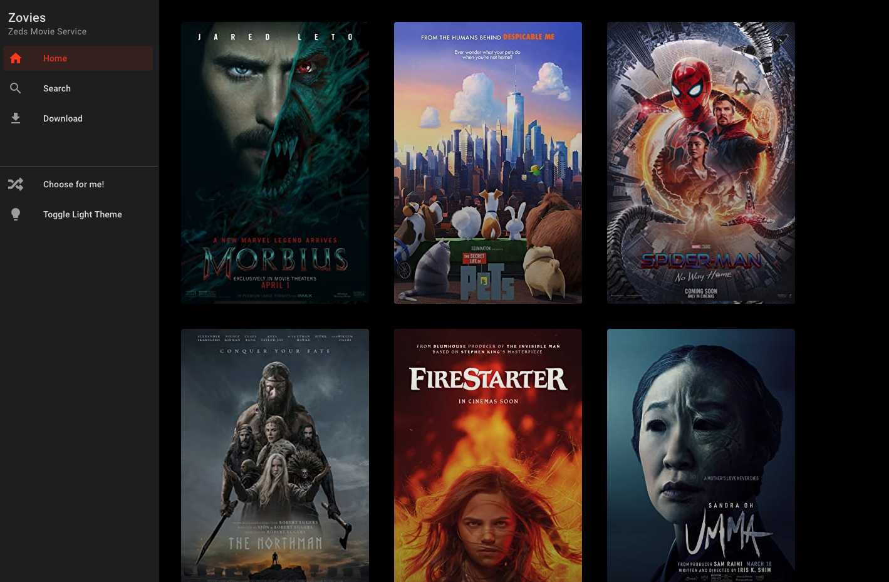
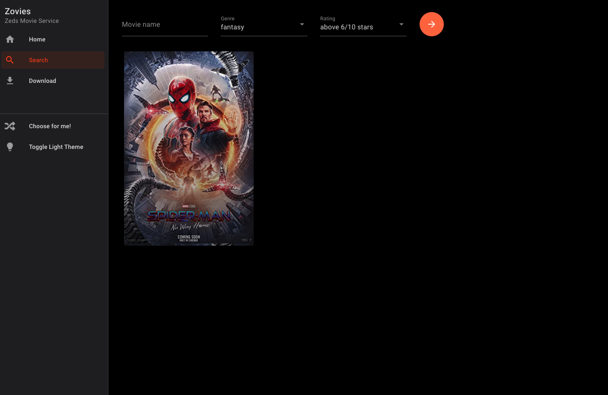
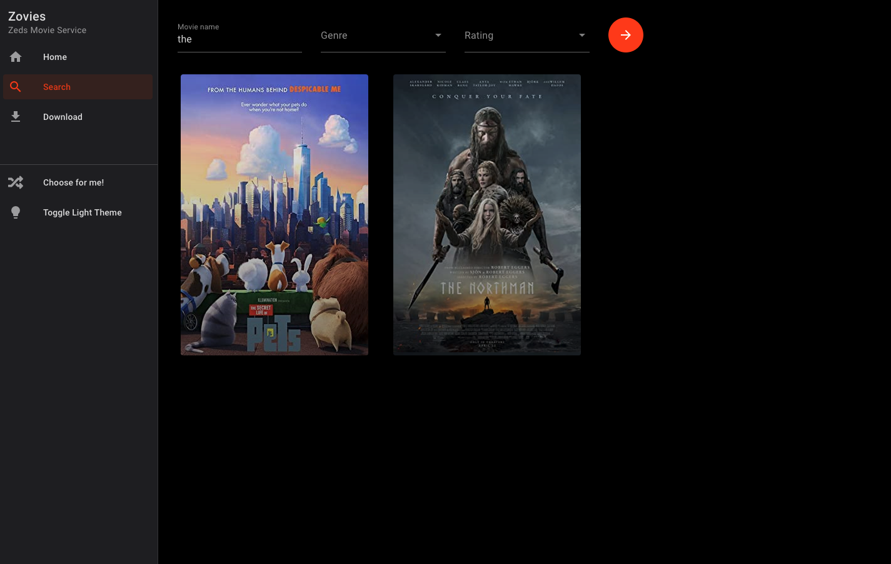

# Zovies-UI
The UI for [the Zovies backend](https://github.com/Zed-Bailey/Zovies)

Developed with svelte this web app will run on your local network and stream movies from the backend with faster then a streaming service, enjoy watching your movies with no buffering :)

## Setup

(this setup assumes you are running on a raspberry pi)
- find the ip address of the device with `ifconfig` note this down
- install node onto the raspberry pi [steps if not already installed](https://www.makersupplies.sg/blogs/tutorials/how-to-install-node-js-and-npm-on-the-raspberry-pi)
- clone this repo onto the pi
- edit the ApiBase variable in the persistent/api.js file with the IP address noted down eg `http://192.168.1.1:8080/api/` the api will have been setup to run on port 8080 with the same IP adress
- execute `npm run build` which will invoke the svelte compiler to build a production version of the application into a `build/` folder 
- then run the application with `sudo PORT=80 node build` which will deploy the application running on port 80
- navigate to the IP address noted down before, if the api is running then volia, zovies is setup for you

## Screen shots

**Home**

**Search**

**Search with keyword**
